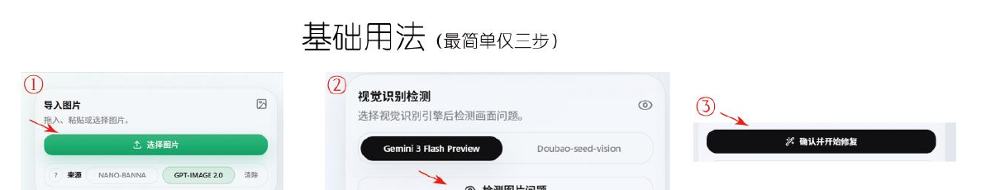
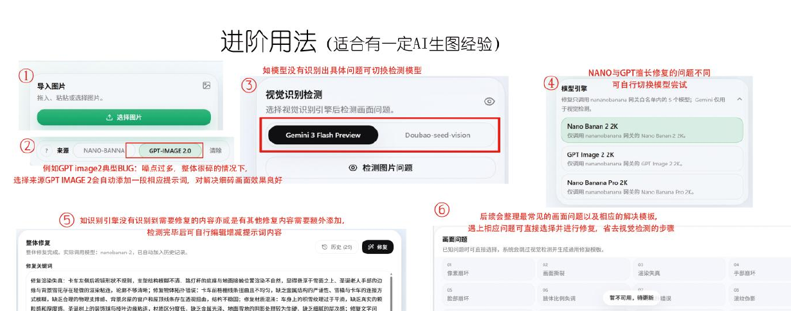

# FIXI 2.0 Community

<p align="center">
  
</p>

<p align="center">
  
  
  
  
</p>

> 面向创作者与设计工作流的本地 AI 图片修复工具。上传参考图、识别画面问题、编辑修复要求，再通过你自己的图生图网关完成修复。



---

## 项目说明

FIXI 2.0 Community 是不含任何内置密钥的社区开源版本。仓库不会包含：

- 第三方网关地址、API Key 或账号额度信息。
- 用户上传的原图、修复图、历史记录或模型调用记录。
- 作者本地的环境文件、个人配置与缓存数据。

你可以在自己的电脑、工作室服务器或可信局域网中运行它，并在应用设置里填写自己的图生图服务。

---

## 快速开始

```powershell
# 1. 克隆仓库
git clone https://github.com/JensenZhong87/fixi-2.0-community.git
cd fixi-2.0-community

# 2. 安装依赖
pnpm install

# 3. 启动开发服务器
pnpm dev
```

打开终端输出的本地地址即可使用。

生产构建：

```powershell
pnpm build
pnpm start
```

---

## 技术栈

| 层面 | 技术 |
|------|------|
| 前端框架 | React 19 + TypeScript |
| 样式方案 | Tailwind CSS 4 |
| 构建工具 | Vite 6 |
| 后端运行时 | Express 4 (tsx) |
| 包管理 | pnpm (workspace) |
| 动效 | motion (Framer Motion) · ogl (WebGL) |
| 图标 | lucide-react |
| AI 视觉识别 | Google Gemini API（可选） |

## 项目结构

```
fixi-2.0-community/
├── src/
│   ├── App.tsx                 # 主应用组件
│   ├── main.tsx                # React 入口
│   ├── index.css               # 全局样式
│   ├── types.ts                # 类型定义
│   ├── presetData.ts           # 预设数据
│   ├── components/
│   │   ├── Aurora.tsx          # 极光背景动效
│   │   ├── CompareSlider.tsx   # 修复前后对比滑块
│   │   └── Iridescence.tsx     # 虹彩动效
│   └── utils/
│       └── canvasGenerator.ts  # Canvas 图片生成核心
├── public/                     # 静态资源
│   ├── fixi-logo.png
│   ├── fixi-logo.svg
│   └── guide/                  # 使用引导图片
├── server.ts                   # Express 后端入口
├── index.html                  # SPA 入口 HTML
├── vite.config.ts
├── tsconfig.json
├── package.json
├── .env.example                # 环境变量模板
├── .gitignore
├── LICENSE
└── README.md
```

## 功能一览

| 功能 | 用途 | 适合场景 |
| --- | --- | --- |
| 整体修复 | 对整张参考图进行识别与图生图修复 | 模糊、噪点、结构瑕疵、整体渲染问题 |
| 局部修复 | 用红框标记一个或多个需要处理的区域 | 手部、脸部、文字边缘、局部破损与杂物 |
| 视觉识别 | 分析待修复图片，并生成可继续编辑的修复建议 | 不确定问题在哪里或需要提示词起点 |
| 已知问题模板 | 手动选择常见问题，快速补充修复提示词 | 已明确知道图片问题时 |
| 提示词优化 | 在不改变创作意图的前提下整理修复描述 | 需要更清晰、可执行的修复指令时 |
| 无损放大 | 调用本地 Upscayl / Real-ESRGAN 后端进行放大 | 低分辨率素材、细节放大与导出前处理 |
| 历史记录 | 在当前运行环境保存修复结果与调用信息 | 对比版本、下载或继续处理 |

## 环境要求

- Node.js 20 或更高版本。
- pnpm 9 或更高版本。
- 至少一个支持**图生图 / 图片编辑**的 API 网关。
- 使用无损放大功能时，需要额外配置本地 Upscayl / Real-ESRGAN 后端。

> FIXI 发送给修复网关的是参考图和修复提示词。因此，网关必须支持图片编辑或参考图图生图；只支持文生图的模型不能用于修复。

## 本地运行

```powershell
pnpm install
pnpm dev
```

打开终端输出的本地地址即可使用。

生产构建与启动：

```powershell
pnpm build
pnpm start
```

### 可选：配置 Gemini 视觉识别

复制 `.env.example` 为 `.env`，按需填写自己的 Gemini Key：

```env
GEMINI_API_KEY=your_gemini_key
```

未配置视觉识别时，仍可手动填写修复关键词或使用已知问题模板；只是无法获得 Gemini 的自动问题分析。

## 第一次使用

### 1. 配置修复网关

点击页面右上角的齿轮按钮，打开 **网关设置**。开源版提供两类独立配置：

- **NanoBanana**：填写图生图网关地址、模型 ID 与 API Key。
- **ChatGPT Image 2**：填写图片编辑网关地址、模型 ID 与 API Key。

建议使用网关文档中明确标注为 `images/edits`、图片编辑或参考图图生图的模型 ID。保存后，密钥仅写入当前设备的 `data/community-settings.json`，该文件已被 Git 忽略。

### 2. 先点“测试连接”

每张配置卡片都有 **测试连接** 按钮。它会使用你当前填写的网关地址与 API Key 发起带鉴权的模型目录请求，并反馈：

- 网关是否可连通。
- API Key 是否通过认证。
- 你填写的模型 ID 是否出现在网关返回的模型列表中。
- 失败时的 HTTP 状态或网关返回信息。

测试连接**不会生成图片，也不会消耗图像生成额度**。它可在保存前使用，适合先确认配置是否可用。

> “连接成功但未找到模型”通常表示密钥和地址正确，但模型 ID 拼写、大小写或供应商别名不一致。请以网关模型列表为准。

### 3. 上传图片并选择工作模式

顶部可切换三种主模式：

1. **整体修复**：适合整张图的质量、结构或渲染问题。
2. **局部修复**：适合只改动一个或多个明确位置。
3. **无损放大**：适合先把低分辨率素材放大，再进入修复流程。



## 整体修复：推荐流程

1. 上传图片。
2. 在“模型引擎”中选择 NanoBanana 或 ChatGPT Image 2。
3. 选择视觉识别引擎并点击“检测图片问题”。
4. 查看识别出的彩色问题标签与修复建议。
5. 在“修复关键词”中确认、删减或补充描述。
6. 点击“修复”，等待结果返回。
7. 在预览区切换“修复前 / 修复后”，确认后下载、复制或继续迭代。

### 提示词怎么写更稳

把要求写成“保留什么 + 修复什么 + 不要改变什么”三部分，通常比只写“修好图片”更稳定：

```text
保留原图主体、构图、色彩、光影和画风不变；
修复人物手指边缘的断裂与粘连，使手部结构自然、细节清晰；
不要生成新场景，不要替换主体，不要添加无关元素。
```

如果素材来自特定模型，可在“图片来源”中标记来源；FIXI 会将对应的保真与画面清洁要求补充到可编辑的修复关键词中。

## 局部修复：红框只用于定位

1. 进入“局部修复”。
2. 上传图片后点击框选图标，在需要处理的位置拖拽红框；可重复框选多个区域。
3. 如有额外要求，填写“附加要求”并确认。
4. 点击“确认识别并修复”。

局部修复会优先分析红框区域，并在提示词中写入严格约束：只修改红框内及必要融合边缘，红框外的主体、构图、风格、颜色、文字和背景不应被改动。红框仅用于前端定位，正常的修复输出不应保留红框、箭头、标注或选区痕迹。

> 对于文字、手部、脸部、商品标签等高风险细节，建议一次只框选一个较小区域。小范围、多次迭代通常比整图重绘更可控。

## 无损放大

无损放大调用的是本地 Upscayl / Real-ESRGAN 后端，不会使用图生图网关。

1. 切换到“无损放大”。
2. 上传图片并选择合适的放大模型与倍数。
3. 点击“开始无损放大”。
4. 在预览区查看结果，必要时再进入整体或局部修复。

如果提示找不到 Upscayl 后端，请确认本机已安装相应工具，并检查应用提示的可执行文件路径。

## 使用效果

实际修复效果会受到原图质量、网关模型、提示词、上游队列和模型安全策略影响。建议在使用后记录并上传前后对比图，同时说明所用模型、原图问题、提示词和迭代次数。

### 建议的案例说明格式

```text
案例名称：手部结构与边缘修复
原图问题：手指粘连、边缘破碎、局部噪点。
使用模型：NanoBanana。
修复要求：仅修复右手和袖口边缘，保持人物姿势、服装和背景不变。
结果说明：第 2 次迭代获得可用结果。
```

## 温馨提示

- **先备份原图。** 修复是生成式编辑，任何模型都可能重绘局部细节；重要素材请保留原文件。
- **小问题优先局部修复。** 只有一个角落、手部或文字出错时，整图修复会扩大不必要的改动范围。
- **不要把不相关要求塞进同一条提示词。** 一次专注解决 1 到 3 个问题，效果更稳定，也更容易定位模型偏差。
- **先测试网关，再正式修复。** 测试连接能尽早发现 Key、模型 ID 或网关地址问题，避免把正式任务送往错误通道。
- **保护隐私与版权。** 上传图片和提示词会发送到你配置的第三方网关；不要提交敏感个人信息、未获授权的素材或密钥截图。
- **模型成功不等于结果一定可用。** 生成成功后请检查文字、人物五官、手部、边缘、比例和构图，再决定是否保存或继续迭代。
- **修复效果不明显时**，可复制修复后的图片重新粘贴进行第二次修复，或改用另一模型。
- **特殊比例或局部问题**，不建议整张图修复；可截取局部或使用局部修复，效果更稳。

## 常见问题

### “测试连接”失败怎么办？

| 现象 | 常见原因 | 处理建议 |
| --- | --- | --- |
| 401 / 403 | API Key 无效、过期或没有权限 | 在供应商后台确认 Key、额度和模型权限 |
| 404 | 网关地址或 `/v1` 路径不正确 | 按供应商文档填写基础 API 地址 |
| 连接成功但找不到模型 | 模型 ID 不正确或该账号未开通 | 从网关返回的模型列表复制正确 ID |
| 超时 / 5xx | 网关排队、上游故障或网络问题 | 稍后重试，或切换到另一已配置的模型 |
| 修复返回文生图错误 | 当前模型不支持参考图编辑 | 换用支持 `images/edits` 或图生图的模型 |

### 为什么修复后的画面发生变化？

生成式模型不是传统像素级修图工具。请在修复关键词中明确保留主体、构图、画幅比例、风格和色彩；对于局部问题，优先使用红框局部修复。若结果偏离较大，缩小框选范围、减少提示词中的新元素描述，再次尝试。

### 为什么视觉识别不可用？

开源版不内置视觉模型密钥。若要使用 Gemini 自动识别，请在 `.env` 中配置 `GEMINI_API_KEY` 并重启服务；也可以跳过识别，手动输入修复关键词或使用已知问题模板。

## 数据与安全

- 图片、提示词和修复请求仅会发送至你自行配置的第三方服务。
- 网关配置保存在当前运行设备的 `data/community-settings.json`，不会被 Git 提交。
- 请勿提交 `.env`、`data/`、日志、历史记录、截图或任何含 API Key 的文件。
- 在公开部署前，请自行评估网关的隐私政策、内容策略、数据留存与地域合规性。

## 贡献与反馈

欢迎提交 Issue 或 Pull Request。提交问题时请尽量说明：

- 操作系统、Node.js 与 pnpm 版本。
- 使用的模型类别和网关响应状态码。
- 可复现步骤与脱敏后的报错信息。
- 不含个人信息和 API Key 的截图或示例图。

## License

MIT License.
